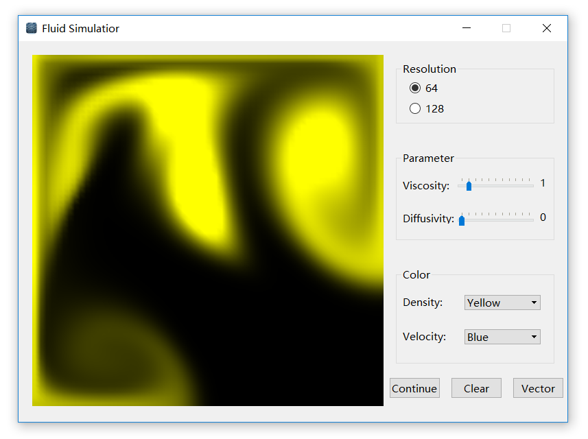
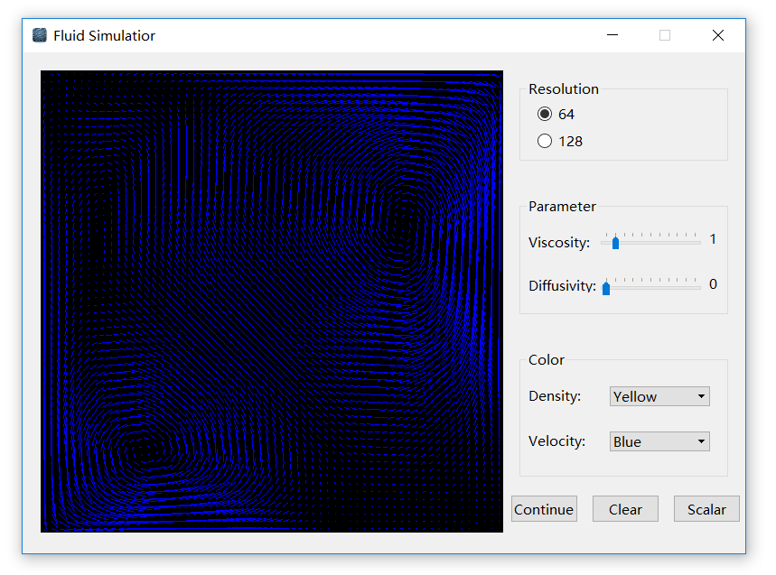

FluidS
===============

Its core algorithm of the simulation process refers to Robert Bridson's <i>Fluid Simulation for Computer Graphics</i>. It uses the numerical solution of Navier-Stokes equations to predict the density and velocity distribution of particles in each frame displayed in the OpenGL widget of Qt. There are two resolution options for users: 64x64 and 128x128. Users can also change display mode between density and velocity in 7 colors.

## Download ##

Download available at <https://github.com/george-chou/FluidS/releases>.

# Build #

## Pre-installed software ##

### Static Qt compiler ###

Source of static qt compiler: [qt-everywhere-opensource-src-5.4.0-rc](http://download.qt.io/development_releases/qt/5.4/5.4.0-rc/single/qt-everywhere-opensource-src-5.4.0-rc.zip)

Tutorial(in Chinese) of building static qt compiler: <https://blog.csdn.net/fuzimango/article/details/45916167>

### Dynamic Qt compiler ###

Installation package of dynamic qt compiler: [qt-opensource-windows-x86-msvc2013_opengl-5.4.1](http://download.qt.io/archive/qt/5.4/5.4.1/qt-opensource-windows-x86-msvc2013_opengl-5.4.1.exe)

## Build worker ##

Microsoft Visual Studio 2013 with [qt-vs-addin-1.2.4-opensource](http://download.qt.io/archive/vsaddin/qt-vs-addin-1.2.4-opensource.exe)

## Environment variables ##

QTDIR = "C:\Qt\5.4\msvc2013_opengl"

## Dependencies ##

### MDd ###

qtmaind.lib;Qt5Cored.lib;Qt5Guid.lib;Qt5OpenGLd.lib;opengl32.lib;glu32.lib;Qt5Widgetsd.lib;%(AdditionalDependencies)

### MTd ###

$(QTDIR)\lib\qtmaind.lib;$(QTDIR)\lib\Qt5Widgetsd.lib;$(QTDIR)\plugins\platforms\qwindowsd.lib;winspool.lib;shlwapi.lib;rpcrt4.lib;$(QTDIR)\lib\Qt5PlatformSupportd.lib;$(QTDIR)\plugins\imageformats\qddsd.lib;$(QTDIR)\plugins\imageformats\qicnsd.lib;$(QTDIR)\plugins\imageformats\qicod.lib;$(QTDIR)\plugins\imageformats\qjp2d.lib;$(QTDIR)\plugins\imageformats\qmngd.lib;$(QTDIR)\plugins\imageformats\qtgad.lib;$(QTDIR)\plugins\imageformats\qtiffd.lib;$(QTDIR)\plugins\imageformats\qwbmpd.lib;$(QTDIR)\plugins\imageformats\qwebpd.lib;$(QTDIR)\lib\Qt5Guid.lib;comdlg32.lib;oleaut32.lib;imm32.lib;winmm.lib;glu32.lib;opengl32.lib;gdi32.lib;$(QTDIR)\lib\qtharfbuzzngd.lib;$(QTDIR)\lib\Qt5Cored.lib;kernel32.lib;user32.lib;shell32.lib;uuid.lib;ole32.lib;advapi32.lib;ws2_32.lib;mpr.lib;%(AdditionalDependencies)

### MT ###

$(QTDIR)\lib\qtmain.lib;$(QTDIR)\lib\Qt5Widgets.lib;$(QTDIR)\plugins\platforms\qwindows.lib;winspool.lib;shlwapi.lib;rpcrt4.lib;$(QTDIR)\lib\Qt5PlatformSupport.lib;$(QTDIR)\plugins\imageformats\qdds.lib;$(QTDIR)\plugins\imageformats\qicns.lib;$(QTDIR)\plugins\imageformats\qico.lib;$(QTDIR)\plugins\imageformats\qjp2.lib;$(QTDIR)\plugins\imageformats\qmng.lib;$(QTDIR)\plugins\imageformats\qtga.lib;$(QTDIR)\plugins\imageformats\qtiff.lib;$(QTDIR)\plugins\imageformats\qwbmp.lib;$(QTDIR)\plugins\imageformats\qwebp.lib;$(QTDIR)\lib\Qt5Gui.lib;comdlg32.lib;oleaut32.lib;imm32.lib;winmm.lib;glu32.lib;opengl32.lib;gdi32.lib;$(QTDIR)\lib\qtharfbuzzng.lib;$(QTDIR)\lib\Qt5Core.lib;kernel32.lib;user32.lib;shell32.lib;uuid.lib;ole32.lib;advapi32.lib;ws2_32.lib;mpr.lib;%(AdditionalDependencies)

## License ##

[Flat icon set](https://www.easyicon.net/550601-Fluid_icon.html) from [easyicon](https://www.easyicon.net/).

All source codes are licensed under [GPL-3.0](https://opensource.org/licenses/GPL-3.0).

If you want to make any modification on these source codes while keeping new laws unprotected by GPL-3.0, please contact me for a sublicense instead.
